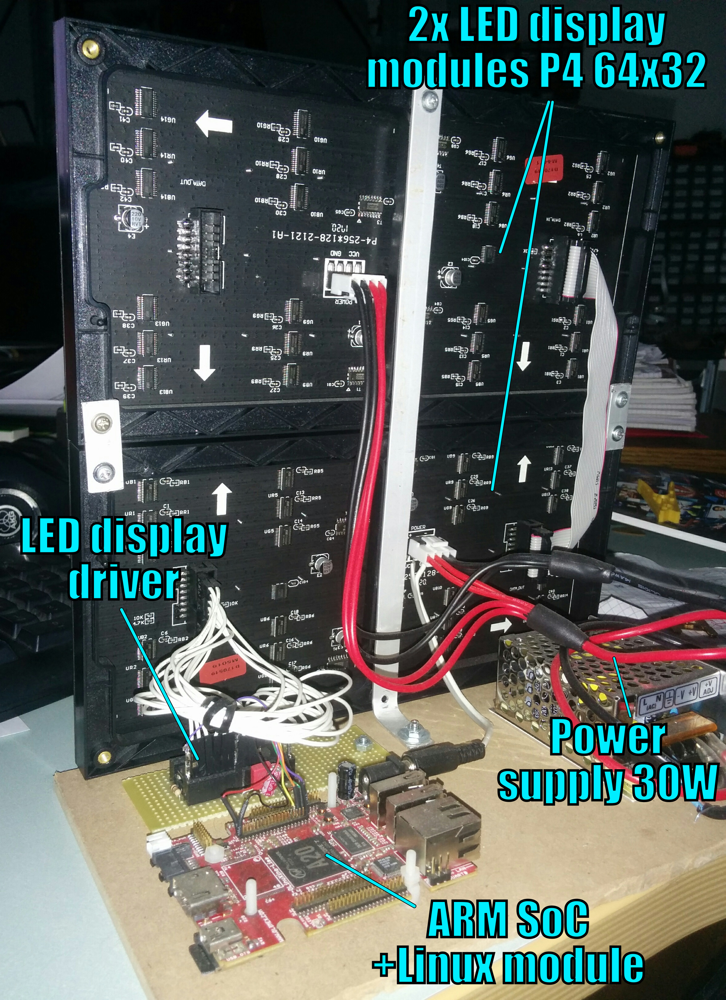
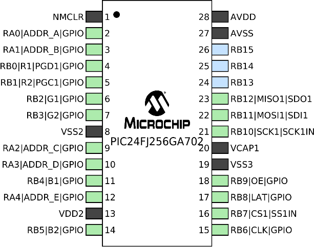
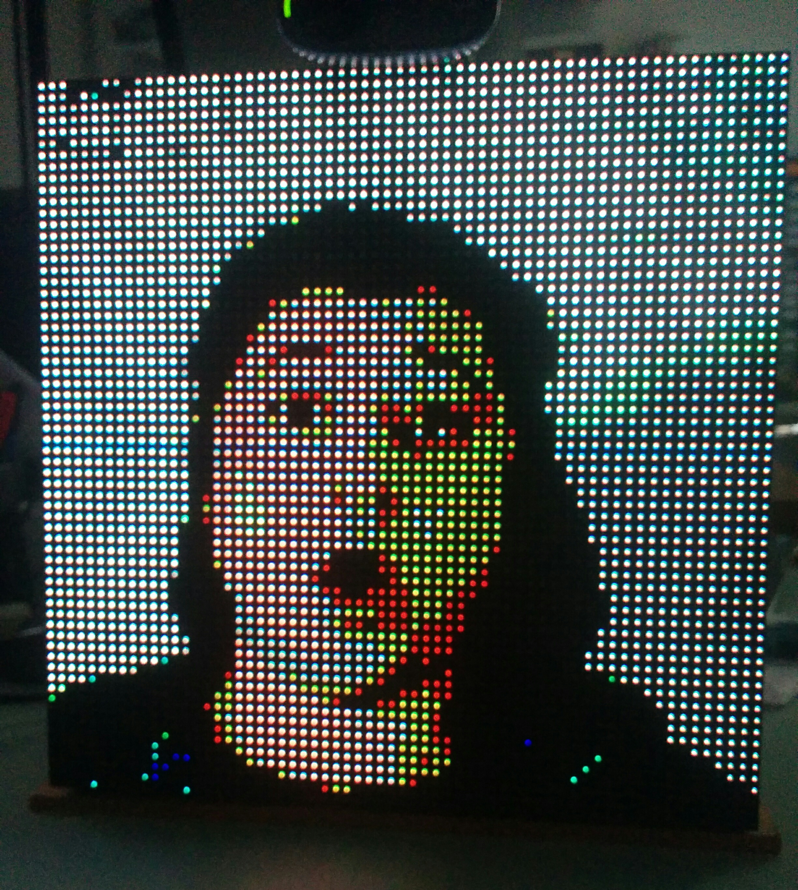

gdpy: cheap low-res Linux LED display
=======================================

This project is a _working_ proof of concept, in building an **extremely**
low cost LED display, using simple custom PIC24-based driver and interfacing
in real-time with a Linux-based ARM SoC.

Driver circuit
--------------

The project consist in a crude display driver based on PIC24FJ256GA702 and
nothing else, attached to the display's HUB75 connector.

Then, the O.S. passes each frame to the driver via a SPI interface. At the
moment, frames are only 64x64 pixels @256 colors [4KiB].

Kernel module
-------------

The kernel module uses an available SPI interface. The current implementation
uses SPI2 (hardcoded value) of the
[Olimex A20-OLinuXino-LIME](https://www.olimex.com/wiki/A20-OLinuXino-LIME),
but can be easily tweaked in the initialization of the structure
`spi_device_info` in `gdpymod.c`.

After the module is compiled and inserted into the running kernel, the user
application must `open()` the device `/dev/gdpymod` in `bw` mode and send each
frame with a simple call to `write()`.

Most of the test code is written in Python, for example a low-res and low-colors
mirror using a webcam.

